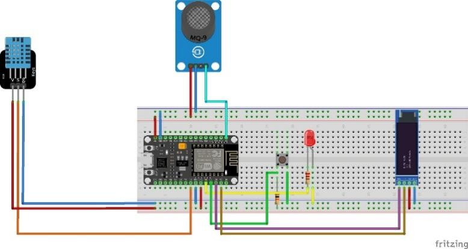

# THE AIR QUALITY MONITORING SYSTEM USING ESP8266 AND BLYNK SERVER MONITORING

## OVERVIEW
Hello! This is a ***hands-on guide*** to help you build your own ***Air Quality Monitoring System using ESP8266 and Blynk Server***.

The system features 2 sensor nodes for data collection and transmission to the Blynk Server.
<p align="center">
  
  <br>
</p>

Each node is designed with the following core modules:
* **Processing & Communication:** ESP8266 NodeMCU (Wi-Fi enabled).
* **Sensing Unit:** MQ-135 (Gas/Air Quality) and DHT11 (Temperature & Humidity).
* **Display Unit:** 0.96" OLED Display for local real-time monitoring.
<p align="center">
  
  <br>
</p>

## FEATURES
* **Dual-Layer Monitoring:** Real-time data visualization via local **OLED display** and remote **Blynk IoT platform**.
* **Multi-Sensor Integration:** High-precision tracking of **Air Quality (MQ-135)**, **Temperature**, and **Humidity (DHT11)**.
* **Instant Alert System:** Automatic push notifications and mobile alerts for significant changes in air pollution levels.
* **Smart Connectivity:** Seamless Wi-Fi integration using **ESP8266** for stable cloud data synchronization.
* **User-Centric Design:** Optimized UI/UX on Blynk app for intuitive environmental tracking.

## COMPONENTS USED
| Component | Function |
| --- | --- |
| **ESP8266 NodeMCU** | Main MCU for data processing & Wi-Fi communication. |
| **0.91" I2C OLED** | Real-time visual interface for sensor data. |
| **DHT11 Sensor** | Monitors ambient temperature and humidity. |
| **MQ-135 Sensor** | Detects hazardous gases and measures air quality. |
| **Misc. Electronics** | Resistors, buttons, and LEDs for circuit interfacing. |

## REQUIRED LIBRARIES
Install these via **Library Manager** (`Ctrl + Shift + I`):
* **Blynk** (by Volodmpyr Shymanskyy)
* **DHT sensor library** & **Adafruit Unified Sensor** (by Adafruit)
* **MQ135** (by Georg Krocker)
* **Adafruit SSD1306** & **Adafruit GFX Library** (by Adafruit)

## WIRING DIAGRAM

| Component | Pin on ESP8266 | Function |
| --- | --- | --- |
| **OLED (SDA)** | **D2** | I2C Data |
| **OLED (SCL)** | **D1** | I2C Clock |
| **DHT11 Sensor** | **D5** | Temperature & Humidity Data |
| **MQ-135 Sensor** | **A0** | Analog Gas Signal |
| **Push Button** | **D4** | Display Toggle |
| **Warning LED** | **D3** | Pollution Alert |

*Note: Ensure your ESP8266 board is powered via USB or a stable 5V source.*
<p align="center">
  
  <br>
</p>

## CONFIGURATION AND CODE UPLOADING

Update your Blynk Template ID, Name, and Auth Token in the code section below.
```cpp
//Paste your Blynk config here
#define BLYNK_TEMPLATE_ID "...."
#define BLYNK_TEMPLATE_NAME "SENSOR NODE1"
#define BLYNK_AUTH_TOKEN "....."
```
*Note: Please refer to the documentation in docs for detailed Blynk setup instructions.*

Enter your Wi-Fi SSID and Password in the code section below.
```cpp
char ssid[] = "type here";  // type your wifi name
char pass[] = "type here";  // type your wifi password
```

### Code Uploading Guide
1. **Connect board to your PC via USB**
2. Open the **Arduino IDE**
3. Select **your correct board** under **Tools → Board**
4. Open **Tools → Port** and select the correct COM port
5. Click the **Upload** button
6. Open the **Serial Monitor** (baud rate: `115200`) to check the logs

## VIDEO PERFORMANCE

