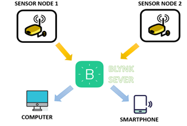
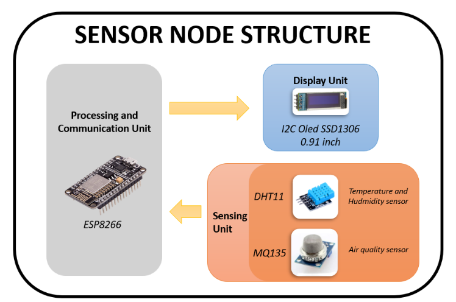

# THE AIR QUALITY MONITORING SYSTEM USING ESP8266 AND BLYNK SERVER MONITORING

## OVERVIEW
Hello! This is a ***hands-on guide*** to help you build your own ***Air Quality Monitoring System using ESP8266 and Blynk Server***.

The system features 2 sensor nodes for data collection and transmission to the Blynk Server.

  
   

Each node is designed with the following core modules:
* **Processing & Communication:** ESP8266 NodeMCU (Wi-Fi enabled).
* **Sensing Unit:** MQ-135 (Gas/Air Quality) and DHT11 (Temperature & Humidity).
* **Display Unit:** 0.96" OLED Display for local real-time monitoring.

  
   

## FEATURES
* **Dual-Layer Monitoring:** Real-time data visualization via local **OLED display** and remote **Blynk IoT platform**.
* **Multi-Sensor Integration:** High-precision tracking of **Air Quality (MQ-135)**, **Temperature**, and **Humidity (DHT11)**.
* **Instant Alert System:** Automatic push notifications and mobile alerts for significant changes in air pollution levels.
* **Smart Connectivity:** Seamless Wi-Fi integration using **ESP8266** for stable cloud data synchronization.
* **User-Centric Design:** Optimized UI/UX on Blynk app for intuitive environmental tracking.

## COMPONENTS USED
| Component | Function |
| --- | --- |
| **ESP8266 NodeMCU** | Main MCU for data processing & Wi-Fi communication. |
| **0.91" I2C OLED** | Real-time visual interface for sensor data. |
| **DHT11 Sensor** | Monitors ambient temperature and humidity. |
| **MQ-135 Sensor** | Detects hazardous gases and measures air quality. |
| **Misc. Electronics** | Resistors, buttons, and LEDs for circuit interfacing. |
